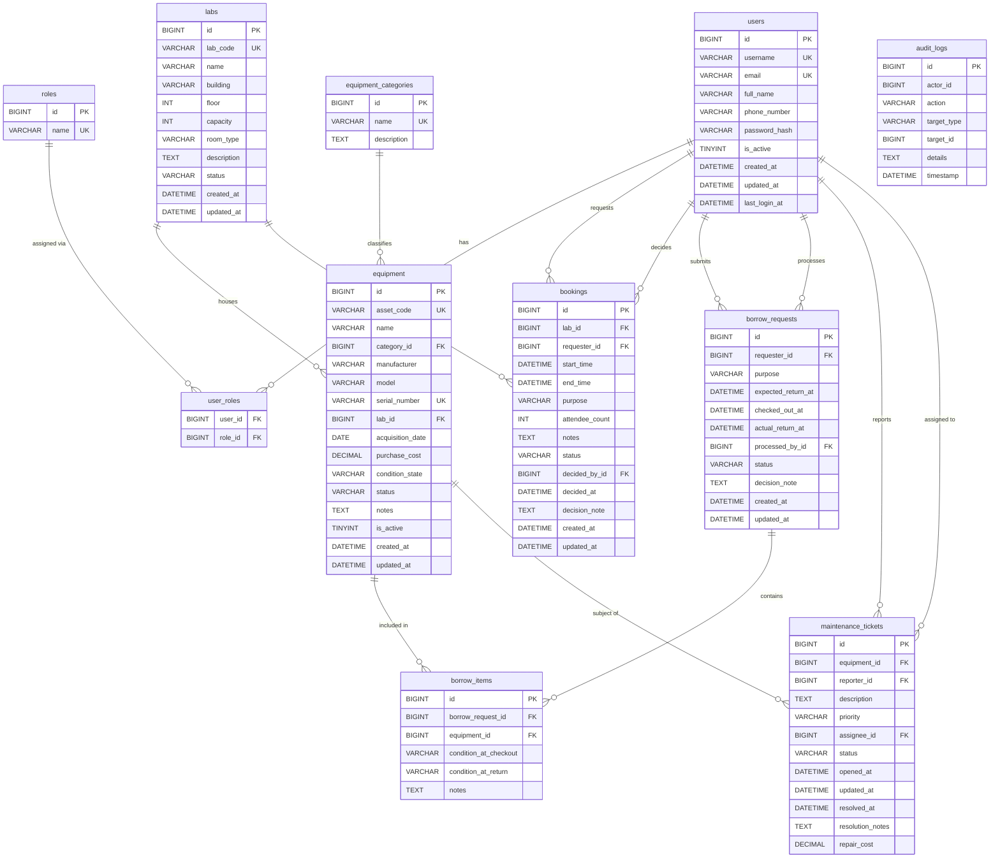

# LabHub - Entity Relationship Diagram

```mermaid
erDiagram
    users {
        BIGINT id PK
        VARCHAR username UK
        VARCHAR email UK
        VARCHAR full_name
        VARCHAR phone_number
        VARCHAR password_hash
        TINYINT is_active
        DATETIME created_at
        DATETIME updated_at
        DATETIME last_login_at
    }

    roles {
        BIGINT id PK
        VARCHAR name UK
    }

    user_roles {
        BIGINT user_id FK
        BIGINT role_id FK
    }

    labs {
        BIGINT id PK
        VARCHAR lab_code UK
        VARCHAR name
        VARCHAR building
        INT floor
        INT capacity
        VARCHAR room_type
        TEXT description
        VARCHAR status
        DATETIME created_at
        DATETIME updated_at
    }

    equipment_categories {
        BIGINT id PK
        VARCHAR name UK
        TEXT description
    }

    equipment {
        BIGINT id PK
        VARCHAR asset_code UK
        VARCHAR name
        BIGINT category_id FK
        VARCHAR manufacturer
        VARCHAR model
        VARCHAR serial_number UK
        BIGINT lab_id FK
        DATE acquisition_date
        DECIMAL purchase_cost
        VARCHAR condition_state
        VARCHAR status
        TEXT notes
        TINYINT is_active
        DATETIME created_at
        DATETIME updated_at
    }

    bookings {
        BIGINT id PK
        BIGINT lab_id FK
        BIGINT requester_id FK
        DATETIME start_time
        DATETIME end_time
        VARCHAR purpose
        INT attendee_count
        TEXT notes
        VARCHAR status
        BIGINT decided_by_id FK
        DATETIME decided_at
        TEXT decision_note
        DATETIME created_at
        DATETIME updated_at
    }

    borrow_requests {
        BIGINT id PK
        BIGINT requester_id FK
        VARCHAR purpose
        DATETIME expected_return_at
        DATETIME checked_out_at
        DATETIME actual_return_at
        BIGINT processed_by_id FK
        VARCHAR status
        TEXT decision_note
        DATETIME created_at
        DATETIME updated_at
    }

    borrow_items {
        BIGINT id PK
        BIGINT borrow_request_id FK
        BIGINT equipment_id FK
        VARCHAR condition_at_checkout
        VARCHAR condition_at_return
        TEXT notes
    }

    maintenance_tickets {
        BIGINT id PK
        BIGINT equipment_id FK
        BIGINT reporter_id FK
        TEXT description
        VARCHAR priority
        BIGINT assignee_id FK
        VARCHAR status
        DATETIME opened_at
        DATETIME updated_at
        DATETIME resolved_at
        TEXT resolution_notes
        DECIMAL repair_cost
    }

    audit_logs {
        BIGINT id PK
        BIGINT actor_id
        VARCHAR action
        VARCHAR target_type
        BIGINT target_id
        TEXT details
        DATETIME timestamp
    }

    users ||--o{ user_roles : "has"
    roles ||--o{ user_roles : "assigned via"

    labs ||--o{ equipment : "houses"
    labs ||--o{ bookings : "booked in"

    equipment_categories ||--o{ equipment : "classifies"
    equipment ||--o{ borrow_items : "included in"
    equipment ||--o{ maintenance_tickets : "subject of"

    users ||--o{ bookings : "requests"
    users ||--o{ bookings : "decides"
    users ||--o{ borrow_requests : "submits"
    users ||--o{ borrow_requests : "processes"
    users ||--o{ maintenance_tickets : "reports"
    users ||--o{ maintenance_tickets : "assigned to"

    borrow_requests ||--o{ borrow_items : "contains"
```
